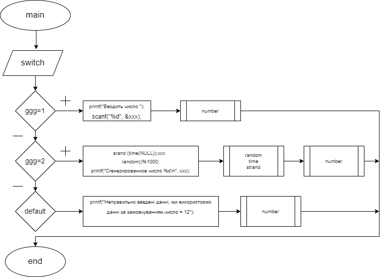
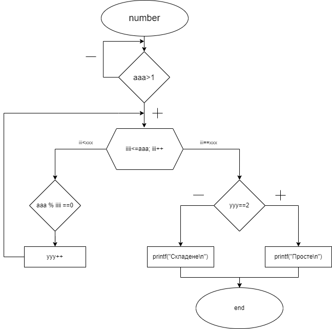

# Лабораторна робота №8 
Загальне завдання:Для лабораторної роботи "Функції" необхідно додати можливість генерації Doxygen документації.
## Вимоги:

Розробник: Tabachnyk Artem

Завдання: Задокументувати лабораторну роботу №7

## Опис програми:

### Функціональне призначення.
Програма визначає просте чи складене число.

### Призначення та опис структури розроблених методів констант та змінних.

Опис функцій

int main() Основна функція main.

  Аргументи
  
  ххх	змінна яка буде передаватися в функцію number для виконання задачі(визначате просте чи складне число)
  ggg	змінна за допомогою якої ми вибираємо спосіб роботи программи

int number() Фунція в якій буде виконуватися основна дія(Шукати просте чи складене число)

  Аргументи
  
  aaa	число яке ми будемо визначати просте чи складене
  ууу	кількість дільників на яке число ааа ділиться без остачі
  iii	число на яке ділиться число ааа(з кожним колом цикла збільшується на 1)

### Структура програми

.

├── doc

│   ├── assets

│   │   ├── bsa.drawio

│   │   ├── function_main.png

│   │   └── function_number.png

│   └── lab08.md

├── Doxyfile

├── Makefile

├── README.md

└── src

## Варіанти використання
- Число повинно бути цілим, не дорівнювати 0
- Число може бути введене з термынала користувачем
- Число може бути сформано рандомно в діапазоні від 10 до 20
- Число може бути використане за замовчуванням

## Висновки:
При виконанні лабораторної роботи були набуті практичні навички створення документації на мові С.
